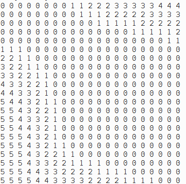
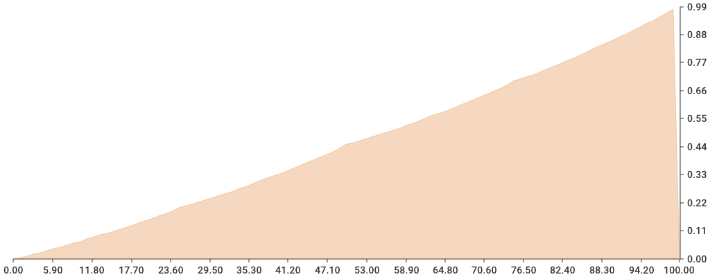
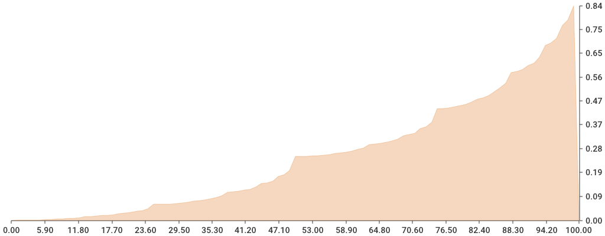

# Aprendizaje-por-Refuerzo
En este repositorio se llevaran a cabo varios ejemplos que utilizan los diferentes métodos de aprendizaje por refuerzo como lo son Programación Dinámica, SARSA, Q-Learning, entre otros.

# Solación para el problema Jack Car Rental

Solución despues de 4 episodios.

# Graficas para el problema Gambler's (El apostador)

con una probabilidad de .45.

con una probabilidad de .25.
